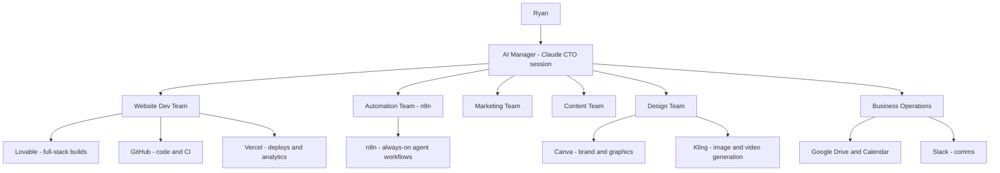

# AI Company Operating System — Blueprint & Playbook

Owner: Ryan Dhana · Maintained by: Claude (AI CTO)
Status: v1 — living document. Every new project runs through this system.

---

## 1. What this is

One central AI Manager (Claude, in this workspace) coordinating specialist AI
agents across build, automation, marketing, content, design, and operations.
Agents are not hypothetical — each one maps to a tool that is actually
connected to this workspace. Anything not yet connected is listed in the Gap
Register (section 7) so nothing is assumed.

## 2. Architecture at a glance

## 3. The Manager (Level 1)

The AI Manager is this Claude workspace acting as CTO/operations manager. Its
standing duties on every project:

1. Analyse the request and break it into tasks.
2. Run the environment / prerequisite check before any build (see section 6).
3. Assign each task to the right specialist (section 4 routing table).
4. Track progress, surface blockers and missing requirements immediately.
5. Keep this document and per-project docs updated in the repo.
6. Report at the end of every project: what shipped, what remains, what's next.
7. Ask before irreversible or destructive actions; otherwise proceed.

Scheduled reporting (daily summary, weekly report) is implemented as n8n
workflows once the n8n connector is enabled in the session.

## 4. Teams and routing table (Levels 2–7)

| Need | Agent / Team | Tool that executes it | Status |
|---|---|---|---|
| Full-stack websites, landing pages, SaaS | Frontend + Backend Engineer | Lovable (React/Tailwind/shadcn, Supabase, Stripe) or hand-built Next.js in GitHub repo | ✅ Connected |
| Custom code, Next.js/Three.js/Framer Motion | Frontend Engineer | This workspace writes code directly into GitHub repos | ✅ Ready |
| APIs, auth, databases, webhooks | Backend Engineer | Lovable backend (Supabase) or custom repo code | ✅ Connected |
| Deployment, domains, SSL, prod | Deployment Engineer | Vercel connector (deploy, logs, analytics, domains) | ✅ Connected |
| QA: bugs, performance, a11y, SEO | QA Agent | This workspace (Playwright/Chromium available) + Vercel runtime logs | ✅ Ready |
| Always-on automations, webhooks, scheduled agents | Workflow Automation Agent | n8n (workflow SDK via connector) | ⚠️ Connector currently off — re-enable in chat settings |
| Building new specialised AI agents | AI Agent Builder | n8n AI Agent workflows (Claude via n8n credits — no API keys) | ⚠️ Same as above |
| External integrations, MCP servers, packages | Integration Engineer | This workspace (ToolSearch/connector registry, npm, Docker) | ✅ Ready |
| Facebook / TikTok / Google ads drafts | Ads Agents | n8n Ads Agent (live) + Claude for strategy; publishing to Meta/TikTok needs their APIs (gap) | 🟡 Drafting live, publishing manual |
| SEO, email, SMS, affiliate marketing | Marketing Agents | SEO: workspace audits; Email: Gmail connector (needs auth); Affiliate: n8n Affiliate Agent (live) | 🟡 Partial |
| Social captions, blogs, sales copy, scripts, hooks | Content Team | n8n Content Agent (live, daily) + workspace for long-form | ✅ Live |
| Video generation, reels, product promos | Video Marketing Agent | Kling connector (text/image → video) | ✅ Connected |
| Logos, brand kits, graphics, mockups | Design Team | Canva connector + Kling image generation | ✅ Connected |
| Customer support chat | Support Agent | n8n Customer Service chat workflow (live, 24/7) | ✅ Live |
| CRM, invoices, payments | Business Ops | Stripe via Lovable projects; dedicated CRM is a gap | 🔴 Gap |
| Analytics & BI | Analytics Agent | Vercel web analytics + n8n data tables; dashboards on request | 🟡 Partial |
| Tasks, knowledge base, SOPs | Ops/Docs Agent | This repo (`docs/`), n8n data tables, Google Drive | ✅ Ready |

## 5. Currently deployed agents (live in n8n)

Built 2026-07-28 in project `uFcEmgtYEFyGauyy` (ryan1515.app.n8n.cloud). All
agents are **general-purpose**: they read the `Business Profile` data table at
runtime, so pointing the whole company at a different business means editing
one table row — no workflow changes.

| Agent | Workflow ID | Trigger | Output |
|---|---|---|---|
| AI Manager (orchestrator) | cVOaVg8smx6412Kq | Hosted chat | Delegates to Content / Copy+Ads / Research specialist sub-agents, compiles results |
| Content Agent | 25JpHXIZXIyAvwLG | Daily 09:00 | Content Queue data table |
| Customer Service Agent | 0er3heB5espW8eEK | Hosted chat, 24/7 | Live chat replies (profile-driven facts) |
| Research Agent | E3EeEIq9274TzbE4 | Mondays 08:00 | Research Reports data table (live web search) |
| Affiliate Agent | 2UEt08SHOgBw8Kp3 | Webhook `/affiliate-signup` | Affiliate Outreach table + response |
| Ads Agent | mVa6ZEvC5w0xxef0 | Mondays 10:00 | Ad Drafts data table |
| Daily Summary | trijC0dd0NbhXLJg | Daily 18:00 | Manager Reports data table |
| Weekly Report | cuJ1hUpX24cbau7n | Mondays 07:00 | Manager Reports data table |

Data tables: Business Profile (config), Content Queue, Research Reports,
Affiliate Outreach, Ad Drafts, Manager Reports.

## 6. Installation & Environment Agent (Level 8)

Before any build, the Manager verifies prerequisites in the build environment.
Last check (2026-07-28):

| Tool | Status |
|---|---|
| Node.js 22 / npm / pnpm | ✅ Installed |
| Python 3.11 | ✅ Installed |
| Git | ✅ Installed |
| Docker | ✅ Installed |
| Playwright + Chromium | ✅ Pre-installed |
| GitHub access | ✅ Via GitHub connector (gh CLI intentionally replaced by it) |
| Vercel access | ✅ Via Vercel connector (CLI not needed) |
| n8n access | ⚠️ Connector toggled off in chat — re-enable to restore |
| Gmail | 🔴 Needs authorization in claude.ai connector settings |

Rule: never assume a tool is installed — re-run this check at the start of
each project and record deltas here.

## 7. Gap Register (be honest about what's missing)

1. ~~n8n connector off~~ — resolved 2026-07-28; Manager, reports, and generic
   agents shipped.
2. **Gmail credential inside n8n** — claude.ai Gmail is authorized, but n8n
   workflows need their own Gmail credential to email reports. Fix: in n8n go
   to Credentials → Add credential → Gmail → Sign in with Google. Then the
   report workflows can gain a "send email" step.
3. **Ad platform publishing** (Meta/TikTok/Google Ads APIs) — agents draft
   ads; publishing is manual until ad accounts + APIs are connected.
4. **SMS marketing** — no provider connected (Twilio or similar needed).
5. **Dedicated CRM** — none connected; interim: n8n data tables + Lovable app.

## 8. Standard project workflow

1. Manager analyses the request and writes a task breakdown.
2. Environment check (section 6).
3. Build: Dev Team (Lovable / repo code) → Automation Team (n8n wiring).
4. QA: test pages, performance, accessibility, SEO.
5. Deploy: Vercel (or Lovable deploy), domain + SSL.
6. Marketing/Content/Design teams produce launch assets if applicable.
7. Final report: shipped ✅ / remaining ⏳ / recommended next steps →.

## 9. Operating rules

- Production-ready over prototype; maintainable over clever.
- Explain important decisions before major changes; recommend one option with
  trade-offs when several are viable.
- Confirm before irreversible or destructive actions.
- All documentation lives in `docs/` and is updated as part of the work, not
  after it.
- Health-product marketing compliance: claims may only "support / promote /
  help maintain" — never "cure / treat / prevent / diagnose".
